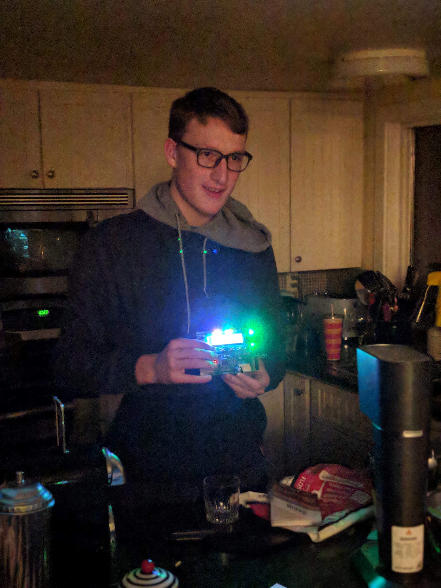

# Laser Tag
An IAR project comprising of the source code for the Engenucis Razor Atmel development boards.
Laser Tag with IR emitters and receivers, complete with three lives and resets for endless fun. Runner up in best final project.

## See it in Action

## How it works

We attached IR emitters and receivers to the board and measured the square wave signal that is outputted when IR light hits the receiver. We used this signal to determine when a user was hit, which resulted in a beeping sound and loss of a life(indicated by the LEDS at the top of the board). After a cooldown of 5 seconds, you were able to be hit again, but also shoot back! Once all three lives were lost a red LED and different beep were triggered.

